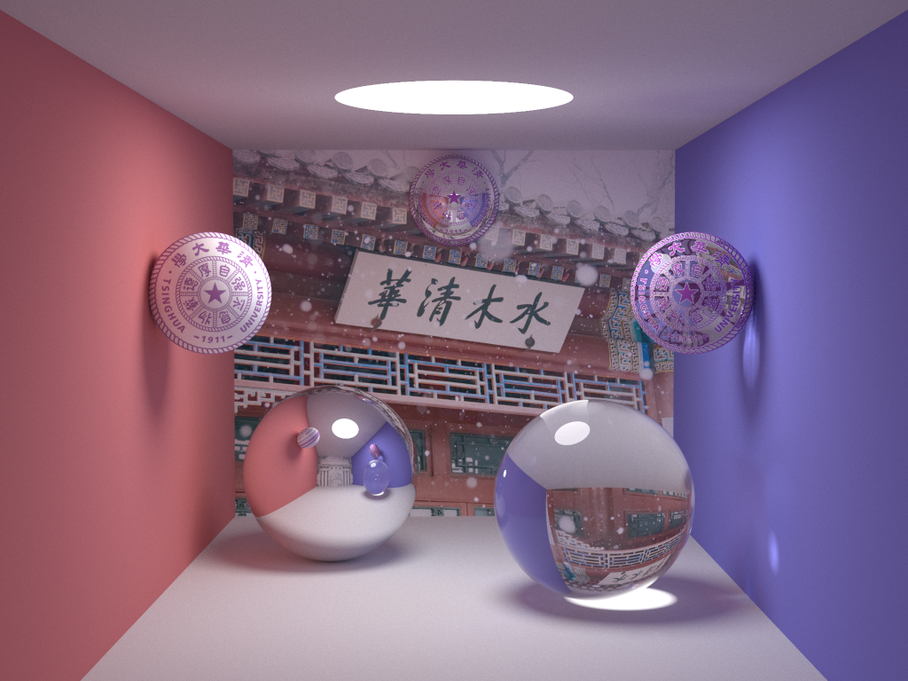

# CG Tracing

[](https://travis-ci.org/xalanq/cg_tracing)
[](https://raw.githubusercontent.com/xalanq/cg_tracing/master/LICENSE)

A Rust implement of path tracing and ray tracing in computer graphics.

# Feature

- Fast: Render with multithreads (Use [rayon](https://github.com/rayon-rs/rayon/))
- Texture: Pin what you want!
- Expandable: Easy to add a geometric object (see example)
- Json: Build from json file, see example
- Structural: More OOP
- Progress bar: Use [a8m/pb](https://github.com/a8m/pb)

# Result

## With Textures (sample 5000)

See [./result/result_1.json](./result/result_1.json)



# Usage

## example (from json, recommended)

see [./example/smallpt_json.rs](./example/smallpt_json.rs) and [./example/smallpt_plane.json](./example/smallpt_plane.json)

```rust
extern crate cg_tracing;

use cg_tracing::prelude::*;

fn main() {
    let (w, mut p) = utils::from_json("smallpt_plane.json", register! {});
    w.render(&mut p);
    p.save_ppm(&format!("example_{}.ppm", w.sample));
}
```

```json
{
    "width": 1024,
    "height": 768,
    "sample": 200,
    "thread_num": 0,
    "stack_size": 267386880,
    "max_depth": 10,
    "Na": 1.0,
    "Ng": 1.5,
    "camera": {
        "origin": { "x": 50.0, "y": 52.0,      "z": 295.6 },
        "direct": { "x": 0.0,  "y": -0.042612, "z": -1.0  },
        "ratio": 0.5135
    },
    "objects": [{
        "type": "Plane",
        "p": { "x": 1.0, "y": 0.0, "z": 0.0 },
        "n": { "x": 1.0, "y": 0.0, "z": 0.0 },
        "t": {
            "raw": {
                "emission": { "x": 0.0,  "y": 0.0,  "z": 0.0  },
                "color":    { "x": 0.75, "y": 0.25, "z": 0.25 },
                "material": "Diffuse"
            }
        }
    }, {
//snip
    }, {
        "type": "Sphere",
        "c": { "x": 50.0, "y": 681.33, "z": 81.6 },
        "r": 600,
        "t": {
            "raw": {
                "emission": { "x": 12.0, "y": 12.0, "z": 12.0 },
                "color":    { "x": 0.0,  "y": 0.0,  "z": 0.0  },
                "material": "Diffuse"
            }
        }
    }]
}
```

## example

see [./example/smallpt.rs](./example/smallpt.rs)

```rust
extern crate cg_tracing;

use cg_tracing::prelude::*;

fn main() {
    let mut p = Pic::new(1024, 768);
    let sample = 200;
    let z = vct!(0, 0, 0);
    let l = vct!(12, 12, 12);
    let (c1, c2) = (vct!(0.75, 0.25, 0.25), vct!(0.25, 0.25, 0.75));
    let (c3, c4) = (vct!(0.75, 0.75, 0.75), vct!(1, 1, 1) * 0.999);
    let camera = cam!(vct!(50, 52, 295.6), vct!(0, -0.042612, -1), 0.5135);
    let max_depth = 10;
    let thread_num = 0; // if set 0. thread number is the number of CPUs available(logical cores).
    let stack_size = 256 * 1024 * 1024;
    let (na, ng) = (1.0, 1.5);
    World::new(camera, sample, max_depth, thread_num, stack_size, na, ng)
        .add(sphere!(vct!(1e5 + 1.0, 40.8, 81.6), 1e5, sphere_raw!(z, c1, Material::Diffuse)))
        .add(sphere!(vct!(-1e5 + 99.0, 40.8, 81.6), 1e5, sphere_raw!(z, c2, Material::Diffuse)))
        .add(sphere!(vct!(50, 40.8, 1e5), 1e5, sphere_raw!(z, c3, Material::Diffuse)))
        .add(sphere!(vct!(50, 40.8, -1e5 + 170.0), 1e5, sphere_raw!(z, z, Material::Diffuse)))
        .add(sphere!(vct!(50, 1e5, 81.6), 1e5, sphere_raw!(z, c3, Material::Diffuse)))
        .add(sphere!(vct!(50, -1e5 + 81.6, 81.6), 1e5, sphere_raw!(z, c3, Material::Diffuse)))
        .add(sphere!(vct!(27, 16.5, 47), 16.5, sphere_raw!(z, c4, Material::Specular)))
        .add(sphere!(vct!(73, 16.5, 78), 16.5, sphere_raw!(z, c4, Material::Refractive)))
        .add(sphere!(vct!(50, 681.33, 81.6), 600, sphere_raw!(l, z, Material::Diffuse)))
        .render(&mut p);
    p.save_ppm(&format!("example_{}.ppm", sample));
}
```

## Add your geometric object

see [./src/geo/plane.rs](./src/geo/plane.rs)

```rust
use cg_tracing::geo::{Geo, HitResult, Material, TextureImage, TextureRaw};
use cg_tracing::ray::Ray;
use cg_tracing::utils::{EPS, Flt};
use cg_tracing::vct::Vct;
use serde::{Deserialize, Serialize}

#[derive(Clone, Debug, Serialize, Deserialize)]
#[serde(untagged)]
pub enum Texture {
    Raw { raw: TextureRaw },
    Image { image: TextureImage, x: Vct, y: Vct, width_ratio: Flt, height_ratio: Flt },
}

#[derive(Clone, Debug, Serialize, Deserialize)]
pub struct Plane {
    pub p: Vct,     // any point at plane (but it's the left-bottom point of texture image)
    pub n: Vct,     // normal vector of plane
    pub t: Texture, // texture info
}

impl Plane {
    pub fn new(p: Vct, n: Vct, t: Texture) -> Box<dyn Geo> {
        let mut ret = Self { p, n, t };
        ret.init();
        Box::new(ret)
    }
}

impl Geo for Plane {
    // init texture if it is a image
    fn init(&mut self) {
        if let Texture::Image { ref mut image, ref mut x, ref mut y, width_ratio, height_ratio } =
            self.t
        {
            *x /= x.len();
            *y /= y.len();
            assert!(x.dot(y).abs() < EPS);
            assert!(width_ratio > 0.0);
            assert!(height_ratio > 0.0);
            image.load();
        }
    }

    // calculate t, which means r.origin + r.direct * t is the intersection point
    fn hit_t(&self, r: &Ray) -> Option<Flt> {
        let d = self.n.dot(&r.direct);
        if d.abs() > EPS {
            let t = self.n.dot(&(self.p - r.origin)) / d;
            if t > EPS {
                return Some(t);
            }
        }
        None
    }

    // return the hit result
    fn hit(&self, r: &Ray, t: Flt) -> HitResult {
        let pos = r.origin + r.direct * t;
        HitResult {
            pos,
            norm: if self.n.dot(&r.direct) > 0.0 { self.n } else { -self.n },
            texture: match self.t {
                Texture::Raw { ref raw } => *raw,
                Texture::Image { ref image, ref x, ref y, ref width_ratio, ref height_ratio } => {
                    let v = pos - self.p;
                    let px = x.dot(&v) / width_ratio;
                    let py = y.dot(&v) / height_ratio;
                    let col = image.pic.get(px as isize, py as isize);
                    TextureRaw {
                        emission: Vct::zero(),
                        color: Vct::new(
                            col.0 as Flt / 255.0,
                            col.1 as Flt / 255.0,
                            col.2 as Flt / 255.0,
                        ),
                        material: image.material,
                    }
                }
            },
        }
    }
}
```

if you want to use `from_json` with your object

```rust
use cg_tracing::prelude::*;
let (w, mut p) = cg_tracing::from_json("some.json", register! {
    "YourObject1" => YourObjectClass1,
    "YourObject2" => YourObjectClass2
});
```

# Reference

- [smallpt](http://www.kevinbeason.com/smallpt/)
- [go-tracing](https://github.com/xalanq/go-tracing)
