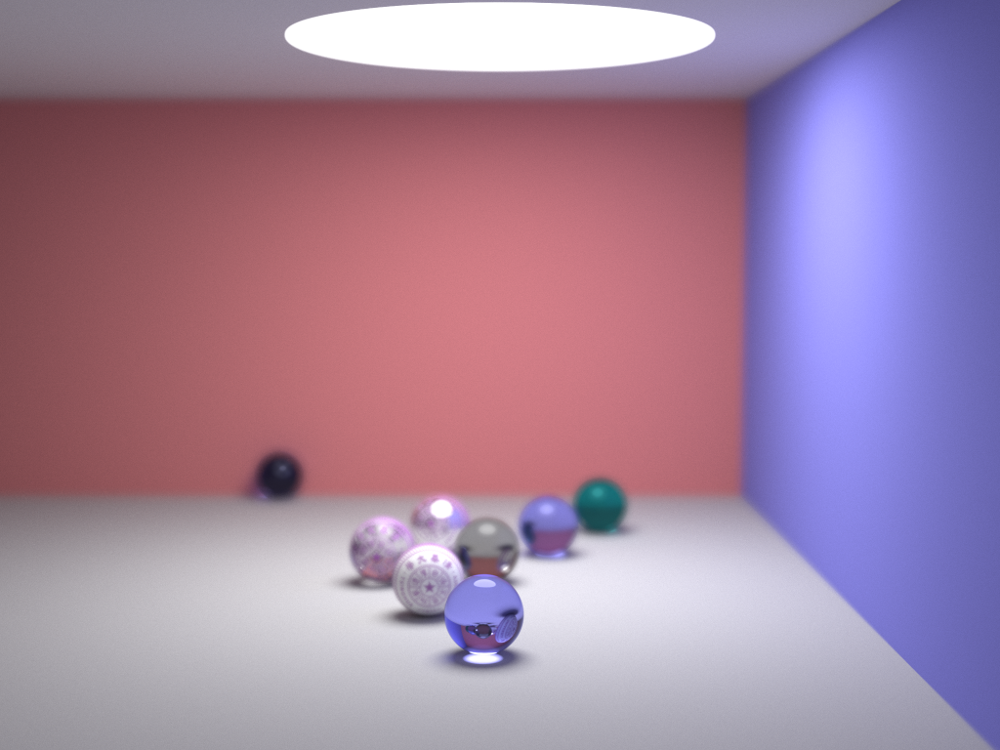
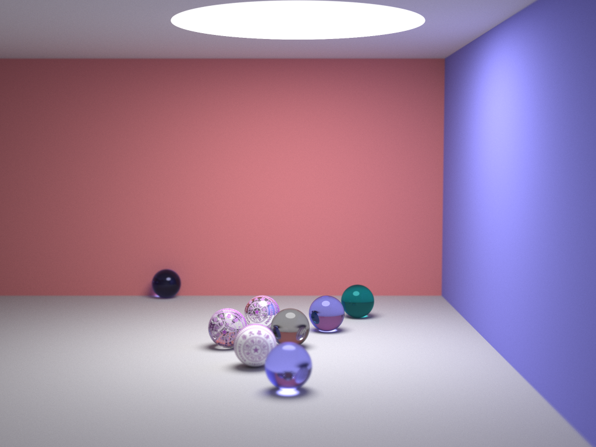

# 作业二报告

## 项目概要

### 环境

整个项目用 Rust 编写，使用 Rayon 库的多线程加速（除了速度比 C/C++ 差点外，Rust 比 C/C++ 好用太多了）。

* cargo 1.35.0 (6f3e9c367 2019-04-04)
* rustc 1.35.0 (3c235d560 2019-05-20) stable-x86_64-pc-windows-msvc

### 代码结构

```
result/                 成果以及相应的配置文件
src/
-- macros.rs              一些宏
-- main.rs                可执行程序入口代码
-- prelude.rs             引用后便能调用项目大部分功能
-- lib.rs
-- geo/                 包含物体渲染所需要的结构
---- mod.rs               定义了物体所需要实现的 trait，即要实现的接口
---- texture.rs           材质
---- collection/        各种物体的具体实现
------ bezier.rs          Bezier 曲线/曲面
------ mesh.rs            三角网格
------ mod.rs
------ plane.rs           平面
------ sphere.rs          球
-------ds/              物体所用到的数据结构
---------bbox.rs          包围盒
---------bsptree.rs       BSP 树
---------kdtree.rs        KD 树
---------mod.rs
-- linalg/              线性代数数学工具
---- mat.rs               4x4 矩阵以及一些矩阵变换
---- mod.rs
---- ray.rs               光线（射线）
---- transform.rs         存储物体的一系列矩阵变换及逆变换
---- vct.rs               三维向量
-- scene/               场景
---- camera.rs            摄像机
---- mod.rs
---- sppm.rs              渐进光子映射所需要的数据结构
---- world.rs             实现了路径追踪和渐进光子映射算法
-- utils/              一些常用工具
---- images.rs            存储材质图片的结构
---- mod.rs               随机数生成器、常用函数等
```

所有图形渲染的参数都能用 JSON 格式的配置文件来设置，整体代码结构也尽量保持了清晰易懂、尽量降低了不同文件之间的耦合性、尽量减少了一些常数开销。

### 得分点

* PT/PPM
* 网格化求交 / Bezier 参数曲面求交
* 算法型加速：Bezier 线性求多项式系数、下山牛顿迭代、KDTree/BSPTree、快速三角面求交、随机数生成器
* 景深、软阴影、抗锯齿、贴图

### 一张比较满意的图

配置文件见 


## 功能实现

### Path Tracing

代码部分参考了  这个项目。

原理是从摄像机成像面的某个像素点不断发出方向随机的射线，射线在经过不同材质表面的物体反射、折射后，最终抵达光源，然后回溯求出色彩信息。

可以发现射线抵达光源是一个小概率事件，因此该算法需要大量采样才能达到令人满意的效果。一般来说，一个像素点采样 8192 次就差不多了。同时由于反射、折射可能无限进行下去，因此还需要限制一下深度，简单场景设置 5 就差不多了。

### Progressive Photon Mapping

原理是先像路径追踪那样从摄像机发送射线，不同的是，PPM 在第一次漫反射的地方停止，并记录交点和对应。然后再从光源随机发出光子，若光子打到了之前记录的某个交点的一个半径为 R 的球内，则统计该光子对这个交点的贡献（Phong 模型来统计）。同时根据统计次数的增多，这个半径 R 应当适当减小。当光子足够多时，则这些贡献累加起来则会趋向于真实值。


## Textures (sample 25000)

See [./result/result_1.json](./result/result_1.json)


## Mesh dragon.obj (sample 25000)

See [./result/result_2.json](./result/result_2.json)


## Rotate Surface by Bezier Curve (sample 25000)

See [./result/result_3.json](./result/result_3.json)


## Depth of field (sample 25000)

See [./result/result_4.json](./result/result_4.json)



See [./result/result_5.json](./result/result_5.json)



# Bezier

$x(t), y(t)$
$$
k = \frac{y(t) - y_o}{y_d}, x(t) = \sqrt{(x_o + k x_d)^2 + (z_o + k z_d)^2}
$$

平方后两边乘$y_d^2$，有
$$
y_d^2 x^2(t) = [x_o y_d + (y(t) - y_o) x_d]^2 + [z_o y_d + (y(t) - y_o) z_d]^2
$$
则令

$$
\begin{align}
f(t) 
= & [x_o y_d + (y(t) - y_o) x_d]^2 + [z_o y_d + (y(t) - y_o) z_d]^2 - y_d^2 x^2(t) \\
= & (x_d^2 + z_d^2) y^2(t) + 2[(x_o y_d - y_o x_d) x_d + (z_o y_d - y_o z_d) z_d] y(t) + \\
& (x_o y_d - y_o x_d)^2 + (z_o y_d - y_o z_d)^2 - y_d^2 x^2(t) \\
= & a y^2(t) + b y(t) + c + w x^2(t)
\end{align}
$$

其中
$$
a = x_d^2 + z_d^2, \quad b = 2[(x_o y_d - y_o x_d) x_d + (z_o y_d - y_o z_d) z_d] \\
c = (x_o y_d - y_o x_d)^2 + (z_o y_d - y_o z_d)^2, \quad w = -y_d^2
$$
则

$$
f'(t) = 2 a y(t) y'(t) + b y'(t) + 2 w x(t) x'(t)
$$

牛顿迭代求出 $t$ 后，再推 $k$ 即可。但若 $y_d = 0$，则再解个方程即可（此时 $t$ 已经求出）。
$$
\begin{align}
&
(x_o + k x_d)^2 + (z_o + k z_d)^2 = x^2(t) \\
\Rightarrow &
(x_d^2 + z_d^2) k^2 + 2(x_o x_d + z_o z_d) k + x_o^2 + x_d^2 - x^2(t) = 0
\end{align}
$$

若 $x(t) \neq 0$ 法向量

$$
P(t, \theta) = (x(t) \cos \theta, y(t), x(t) \sin \theta)
$$

$$
\begin{align}
\frac{\partial P(t, \theta)}{\partial t} \times \frac{\partial P(t, \theta)}{\partial \theta}
& = (x'(t) \cos \theta, y'(t), x'(t) \sin \theta)) \times (-x(t) \sin \theta, 0, x(t) \cos \theta)
\end{align}
$$

当 $x(t) = 0$ 时，法向量直接为 $(0, -y_d, 0)$

# Usage

## example (from json, recommended)

see [./result/result_2.json](./result/result.json).

```rust
extern crate cg_tracing;

use cg_tracing::prelude::*;

fn main() {
    let (w, mut p, path) = utils::from_json("./example/result_2.json", register! {});
    w.stochastic_progressive_photon_mapping(&mut p);
    p.save_png(&path);
}
```

## Add your geometric object

see [./src/geo/plane.rs](./src/geo/plane.rs)

```rust
use crate::{
    geo::{Geo, HitResult, HitTemp, Texture, TextureRaw},
    linalg::{Ray, Transform, Vct},
    Deserialize, Serialize, EPS,
};

#[derive(Clone, Debug, Serialize, Deserialize)]
pub struct Plane {
    pub transform: Transform,
    pub texture: Texture,
}

impl Plane {
    pub fn new(texture: Texture, transform: Transform) -> Self {
        Self { texture, transform }
    }
}

impl Geo for Plane {
    // calculate t, which means r.origin + r.direct * t is the intersection point
    fn hit_t(&self, r: &Ray) -> Option<HitTemp> {
        let n = self.transform.z();
        let d = n.dot(r.direct);
        if d.abs() > EPS {
            let t = n.dot(self.transform.pos() - r.origin) / d;
            if t > EPS {
                return Some((t, None));
            }
        }
        None
    }

    // return the hit result
    fn hit(&self, r: &Ray, tmp: HitTemp) -> HitResult {
        let pos = r.origin + r.direct * tmp.0;
        let n = self.transform.z();
        HitResult {
            pos,
            norm: if n.dot(r.direct) > 0.0 { n } else { -n },
            texture: match self.texture {
                Texture::Raw(ref raw) => *raw,
                Texture::Image(ref img) => {
                    let v = pos - self.transform.pos();
                    let px = self.transform.x().dot(v) * img.width_ratio;
                    let py = self.transform.y().dot(v) * img.height_ratio;
                    let col = img.image.get_repeat(px as isize, py as isize);
                    TextureRaw {
                        emission: Vct::zero(),
                        color: Vct::new(col.0, col.1, col.2),
                        material: img.material,
                    }
                }
            },
        }
    }
}
```

if you want to use `from_json` with your object

```rust
use cg_tracing::prelude::*;
let (w, mut p) = cg_tracing::from_json("some.json", register! {
    "YourObject1" => YourObjectClass1,
    "YourObject2" => YourObjectClass2
});
```

# Reference

- [smallpt](http://www.kevinbeason.com/smallpt/)
- [go-tracing](https://github.com/xalanq/go-tracing)
